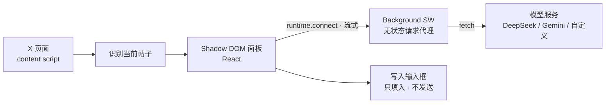

# 贡献指南

本文面向想改代码 / 参与贡献的开发者。安装与使用说明见 [README.md](../README.md)。

## 环境要求

- Node.js ≥ 18
- Chrome / Edge（Manifest V3）
- 一个模型服务商的 API Key（本地调试用）

## 常用命令

```bash
cd extension
npm install
npm run dev            # WXT 开发模式，改代码自动重载
npm run compile        # 类型检查
npm run build          # 构建，产物在 .output/chrome-mv3/
npm run zip            # 打包成可上传商店的 zip
```

改完 `.ts` / `.md` 后需要重新构建，并在 `chrome://extensions` 点一次**重新加载**、**刷新 x.com 标签页**，新的 content script 才会生效。

## 项目结构

```text
extension/
├── entrypoints/       # background service worker、content script 入口
├── components/        # 注入 Shadow DOM 的 React UI（悬浮按钮 / 面板 / 候选卡）
├── lib/llm/           # 服务商适配、流式解析、提示词模板渲染
├── lib/content/x/     # X 页面侧：帖子识别、写入输入框、内容清理
├── prompts/           # 提示词模板（Markdown，构建期内联）
└── public/            # 设置页（静态 HTML + JS，不走构建）
```

提示词不硬编码在代码里：直接改 `extension/prompts/*.md` 即可，支持 `{{变量}}` 与 `{{#if}}`，构建期由 Vite 的 `?raw` 内联成常量。

## 架构总览



LLM 请求只从 background service worker 发出，content script 只负责取页面数据与写回输入框。选型的来龙去脉见 [ARCHITECTURE.md](./ARCHITECTURE.md)。

## 调试

- **耗时诊断**：设置页 →「插件信息 → 开发者选项 → 显示生成耗时信息」可打开面板底部的耗时行（`首字节 / 出字 / 首条 / 完成`），排查速度问题用（默认关）
- **Console 日志**：前缀 `[X Copilot]`，覆盖 Tweet 切换、Modal 检测、SSE 分片、耗时拆解等

## 设计文档

| 文档 | 内容 |
|---|---|
| [PROJECT.md](./PROJECT.md) | 产品需求、范围与红线 |
| [ARCHITECTURE.md](./ARCHITECTURE.md) | 技术选型与关键架构决策 |
| [REPLY_MODULE.md](./REPLY_MODULE.md) | 回复生成模块 |
| [POST_MODULE.md](./POST_MODULE.md) | 发帖模块 |
| [CLEAN_MODULE.md](./CLEAN_MODULE.md) | 清理模块（暂停中） |

## 提交前

1. `npm run compile` 类型检查通过
2. `npm run build` 构建通过
3. 只提交代码与文档 —— 内部排错笔记不进公开树
